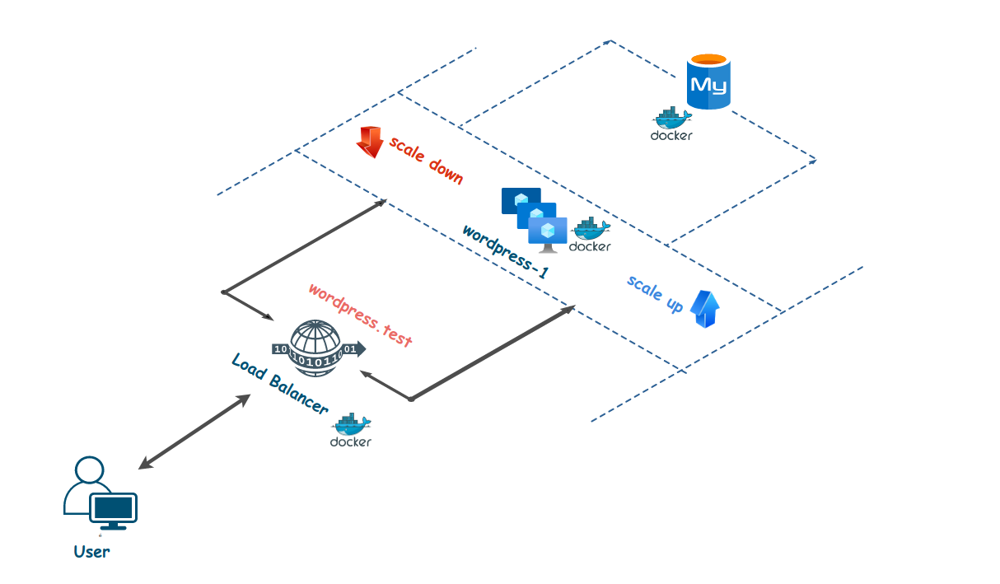
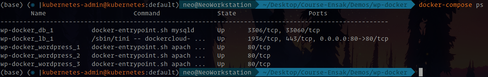
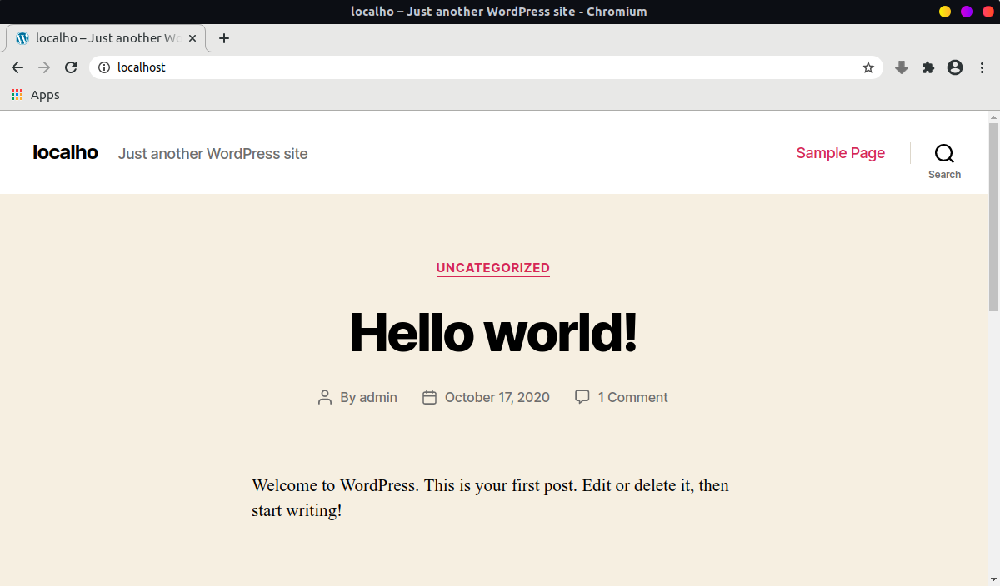

# Deploy wordpress with docker-compose

The goal of this exercise is to deploy a production gradle wordpress application using docker-compose. 

<div align="center">
  
</div>


## Stack 

The applications will be composed of three services : 
  - Wordpress 
  - Mysql 
  - Load Balancer 


## Docker Images 

It is recommended to use the following image for the application services :
  - worpdress:latest
  - mysql:5.7
  - dockercloud/haproxy


## Scaling UP wordpress Instances 

The application should allow scaling wordpress containers with no problem. 

To scale a service in docker-compose to 3 instances for example, run the following command: 

```
$ docker-compose up --scale wordpress=3
```

## Final Result 

After running your services & scaling up wordpress, you should have something like this : 


<div align="center">
  
</div

And Wordpress running on **http://localhost** :

<div align="center">
  
</div